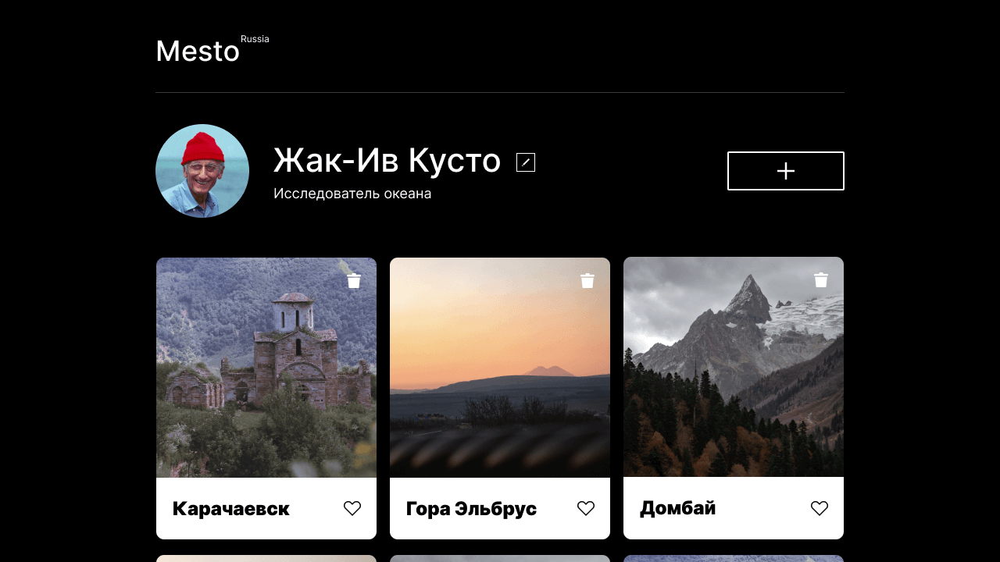

# Проект: "Место"

"Mesto" - сервис для обмена фотографиями, созданная в рамках учебы в Яндекс.Практикум на курсе "Веб-разработчик".

[Открыть проект в браузере](https://xcquake.github.io/mesto/)

## Функционал:

- Просмотр фотографий.
- Редактирование профиля.
- Добавление новой карточки.
- Удаление карточки.
- Возможность ставить лайки.
- Просмотр фотографии в полном размере.
- Подгрузка информации с сервера.
- Валидация форм.

## Технологии:

- HTML5
- CSS3
- TypeScript [ES6]
- Отзывчивая верстка
- Файловая структура по методологии БЭМ (Nested)
- OOP
- Webpack
- Api

## Инструкция по установке:

1.  Клонировать репозиторий

        git clone https://github.com/xcquake/mesto.git

2.  Установить зависимости

        cd mesto

        npm install

3.  Для запуска использовать команды

        npm run dev

    Запуск проекта в режиме разработки.

        npm run build

    Создает финальную сборку проекта, готовую для развертывания, в папке dist
